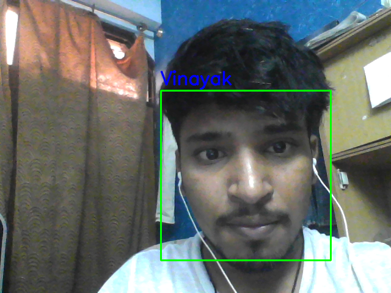

# Project-Face_Detection_and_Recognition
A Deep Learning Project for face detection and recognition using KNN Algo. The project uses harrcascades to recognise the facial features and then store them under clusters of different persons.

The project includes:
1. Scraping out important details from the webcam that constitute a face using Harrcascades.
2. Detecting the face and taking numerous images and placing this data under a certain name tag.
3. Saving these different datasets, and when the recognition code is run it scans the face on the cam   	matches it with the dataset it resembles using KNN Algo and then predict the person on the cam.

